Effect of Drag on Particle Motion
===================================

Overview
--------

This paper describes the derivation and application of the effect of drag on the position and velocity of each particle.

Foundations
-----------

Drag is a force due to the friction between the particle and the medium that it travels through. The force is in the opposite direction of the motion and is proportional to the square of the speed. The magnitude of the drag is defined by the following equation:

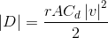
<!-- (1) \left | D \right | = \frac { r A C_d \left | v \right |^2 } {2} -->

where,

 * *Cd* is the "coefficient of drag"
 * *r* is the density of the medium
 * *v* is the velocity of the particle
 * *A* is the equivalent area of the particle

Including the acceleration due to gravity, *g*, the overall acceleration is:

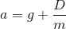
<!-- (2) a = g + \frac {D} {m} -->

In this particle system, the mass of a particle is assumed to be 1. However, the actual mass can be included as a factor in the value of *Cd* (or *r* or *A*).

The velocity of the particle at time *t* is given by this equation (https://en.wikipedia.org/wiki/Drag_(physics)#Velocity_of_a_falling_object):

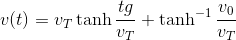
<!-- (3) v(t) = v_T \tanh { \frac { t g } { v_T } + \tanh^{-1} { \frac { v_0 } { v_T } } } -->

where *v0* is the initial velocity and *vT* is the terminal velocity computed as:

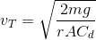
<!-- (4) v_T = \sqrt { \frac { 2 m g} { r A C_d } } -->

The equations can be simplified by assuming that *Cd*, *r*, and *A* are constant, allowing them to be combined:

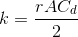
<!-- (5) k = \frac { r A C_d } { 2 } -->

This gives:

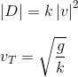
<!-- (6) \\ \left | D \right | = k \left | v \right |^2 \\ \\ v_T = \sqrt { \frac { g } { k } } -->

The distance traveled after time *t* is given by this equation:

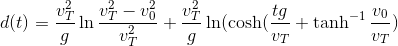
<!-- (7) d(t) = \frac { v_T^2 } { g } \ln {\frac { v_T^2 - v_0^2 } { v_T^2 }} + \frac { v_T^2 } { g } \ln ( \cosh ( \frac { t  g } { v_T } + \tanh^{-1} { \frac { v_0 } { v_T } }  )D_g + D_f -->

These computations all assume that the velocity is always in the direction of gravity. If the initial velocity is not in the same direction, then the computation can be split into the sum of two independent vectors:

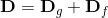
<!-- (8) \mathbf{D} = \mathbf{D}_g + \mathbf{D}_f -->

where *Dg* is the drag in the direction of *g* and *Df* is the drag perpendicular to *g*.

The perpendicular velocity is simply:

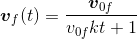
<!-- (9) \boldsymbol{v}_f(t) = \frac { \boldsymbol{v}_0_f } { v_0_f k t + 1 } -->

Combined:

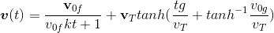
<!-- (10) \boldsymbol{v}(t) = \frac { \mathbf{v}_0_f } { v_0_f k t + 1 } + \mathbf{v}_T tanh ( \frac { t g } { v_T } + tanh^{-1} { \frac { v_0_g } { v_T } } ) -->

Implementation
--------------

Calculating the position is expensive. Euler integration is used to calculate the position because it is probably good enough:

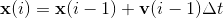
<!-- (11) \mathbf{x}(i) = \mathbf{x}(i-1) + \mathbf{v}(i-1) \Delta t -->

*v(i)* is computed using the equations above substituting *v(i-1)* for *v0*. Here is the code:

Computed once:

	k = r * A * Cd / 2
	direction_g = normalize(g)
	direction_f = [-direction_g.y, direction_g.x]
	x = x0
	vT = direction_g * sqrt(|g| / k)
	vg = direction_g * dot(v0, direction_g)
	vf = direction_f * dot(v0, direction_f)
	v = vf0 + vg0

Computed each update:

	x = x + v * dt
	vg = vT * tanh(dt * g / |vT| + atanh(|vg| / |vT|))
	vf = direction_f * (|vf| / (|vf| * k * dt + 1))
	v = vf + vg
